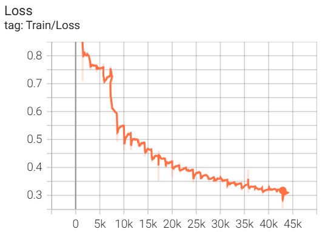
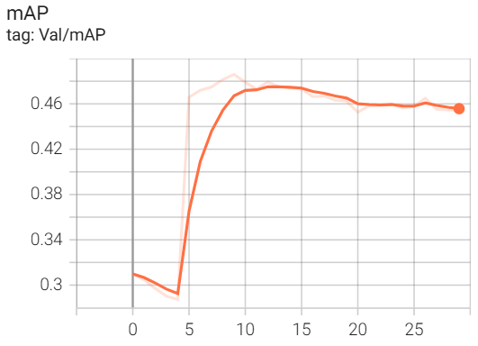
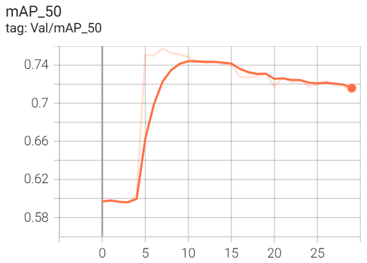
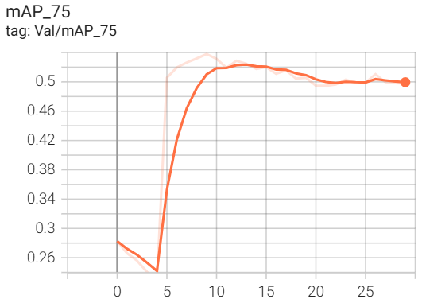

# 🎯 Faster R-CNN Object Detection

<p align="center">
  
  
  
  
</p>

<p align="center">
  A <b>Faster R-CNN</b> application for object detection.
</p>

<p align="center">
  
  <br>
  <em>Streamlit demo — upload an image/video and get bounding boxes instantly.</em>
</p>

---

## 📑 Table of Contents

- [Introduction](#-introduction)
- [Features](#-features)
- [Installation](#installation)
- [Training](#training)
- [Running the demo](#running-the-demo)
- [Interface screenshots](#interface-screenshots)
- [About the model](#-about-the-model)

---

## 📖 Introduction

Train a **Faster R-CNN** model on **Pascal VOC 2012** and demo it through a Streamlit interface — just prepare the data, install the dependencies, train the model (or use an available checkpoint), then run the Streamlit interface to start detecting objects in images or videos.

---

## ✨ Features

- ✅ Object detection on images — bounding boxes, labels, confidence scores
- ✅ Object detection on videos — frame-by-frame processing, exported result video
- ✅ Responsive Streamlit interface, works on desktop & mobile
- ✅ Adjustable confidence threshold directly in the interface
- ✅ Exported result video compatible with all browsers
- ✅ Download the resulting image/video after processing

---

## ⚙️ <a id="installation"></a>Installation

```bash
# 1. Clone the repository
git clone https://github.com/VinhTh-x6/FasterR-CNN.git
cd FasterR-CNN

# 2. Create a virtual environment
python -m venv .venv
source .venv/bin/activate      # Linux/macOS
.venv\Scripts\activate         # Windows

# 3. Install dependencies
pip install -r requirements.txt
```

---

## 🏋️ <a id="training"></a>Training

```bash
python train_fasterrcnn.py 
```

The best checkpoint is automatically saved to `trained_models/best.pt`, which is used in the demo step below.

---

## 🖥️ <a id="running-the-demo"></a>Running the demo

```bash
streamlit run app.py
```

Open your browser at `http://localhost:8501`. The interface has 2 tabs:

- **IMAGE** — upload an image, view the bounding boxes and label list with confidence scores, download the result image.
- **VIDEO** — upload a video, run detection, track processing progress, view and download the result video.

The confidence threshold can be adjusted directly via the slider in the sidebar.

---

## 🖼️ <a id="interface-screenshots"></a>Interface screenshots
 
<p align="center">
  
</p>
<p align="center">
  
</p>

---

## 📊 About the model

The Faster R-CNN model was trained on the Pascal VOC 2012 dataset. Below are the training charts.

<table align="center">
  <tr>
    <td align="center"></td>
    <td align="center"></td>
  </tr>
  <tr>
    <td align="center"></td>
    <td align="center"></td>
  </tr>
</table>

<p align="center"><em>Train Loss, mAP, mAP@50, and mAP@75 charts by epoch.</em></p>

---

<p align="center">
  Made with ❤️ for object detection enthusiasts
</p>