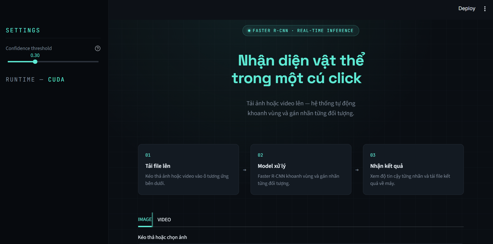
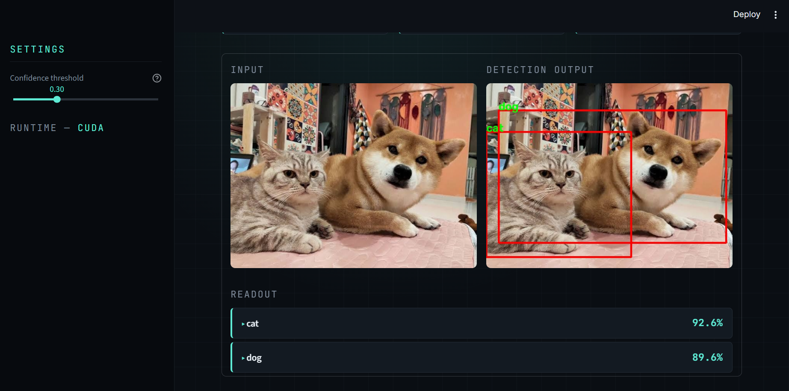

# 🎯 Faster R-CNN Object Detection

<p align="center">
  
  
  
  
</p>

<p align="center">
  Ứng dụng demo <b>Faster R-CNN</b> cho bài toán object detection —
  tải ảnh hoặc video lên và nhận kết quả khoanh vùng, gán nhãn vật thể ngay trên trình duyệt.
</p>

<p align="center">
  
  <br>
  <em>Demo Streamlit — tải ảnh/video lên và nhận kết quả khoanh vùng vật thể ngay lập tức.</em>
</p>

---

## 📑 Mục lục

- [Giới thiệu](#-giới-thiệu)
- [Tính năng](#-tính-năng)
- [Cài đặt](#-cài-đặt)
- [Tải checkpoint mô hình](#-tải-checkpoint-mô-hình)
- [Chạy giao diện demo (Streamlit)](#-chạy-giao-diện-demo-streamlit)
- [Về mô hình](#-về-mô-hình)

---

## 📖 Giới thiệu

Ứng dụng demo cho mô hình **Faster R-CNN** đã được huấn luyện trên bộ **Pascal VOC 2012**  — chỉ cần tải checkpoint, cài thư viện, và chạy giao diện Streamlit để bắt đầu nhận diện vật thể trên ảnh hoặc video. Không cần tự huấn luyện lại mô hình.

---

## ✨ Tính năng

- ✅ Nhận diện vật thể trên ảnh — khoanh vùng, gán nhãn, hiển thị độ tin cậy
- ✅ Nhận diện vật thể trên video — xử lý từng frame, xuất video kết quả
- ✅ Giao diện Streamlit responsive, hỗ trợ desktop & mobile
- ✅ Điều chỉnh ngưỡng độ tin cậy (confidence) trực tiếp trên giao diện
- ✅ Xuất video kết quả tương thích mọi trình duyệt
- ✅ Tải ảnh/video kết quả về máy sau khi xử lý

---

## ⚙️ Cài đặt

### Các bước

```bash
# 1. Clone repository
git clone https://github.com/<username>/faster-rcnn-detect.git
cd faster-rcnn-detect

# 2. Tạo môi trường ảo
python -m venv .venv
source .venv/bin/activate      # Linux/macOS
.venv\Scripts\activate         # Windows

# 3. Cài đặt thư viện
pip install -r requirements.txt
```

> Trên Windows, không cần cài `ffmpeg` riêng — `requirements.txt` đã bao gồm `imageio_ffmpeg`, tự động lo phần xuất video.

---

## 📦 Tải checkpoint mô hình

File checkpoint (`trained_models/best.pt`) không được đưa lên repo do dung lượng lớn. Tải về thủ công trước khi chạy demo:

```bash
mkdir -p trained_models
curl -L -o trained_models/best.pt <LINK_TẢI_CHECKPOINT>
```

> Thay `<LINK_TẢI_CHECKPOINT>` bằng link thật (GitHub Releases / Google Drive / Hugging Face Hub).

---

## 🖥️ Chạy giao diện demo (Streamlit)

```bash
streamlit run app.py
```

Mở trình duyệt tại `http://localhost:8501`. Giao diện gồm 2 tab:

- **IMAGE** — tải ảnh lên, xem kết quả khoanh vùng và danh sách nhãn kèm độ tin cậy, tải ảnh kết quả về máy.
- **VIDEO** — tải video lên, bấm chạy nhận diện, theo dõi tiến trình xử lý, xem và tải video kết quả về máy.

Ngưỡng độ tin cậy (confidence threshold) có thể điều chỉnh trực tiếp ở thanh trượt trong sidebar.

---

## 🖼️ Ảnh demo giao diện
 
<p align="center">
  
</p>
<p align="center">
  
</p>

---

## 📊 Về mô hình

Mô hình Faster R-CNN được huấn luyện trên bộ dữ liệu Pascal VOC 2012. Dưới đây là biểu đồ quá trình huấn luyện.

<p align="center">
  
  
</p>
<p align="center"><em>Biểu đồ Train Loss và Val mAP theo epoch.</em></p>

---

<p align="center">
  Made with ❤️ for object detection enthusiasts
</p>